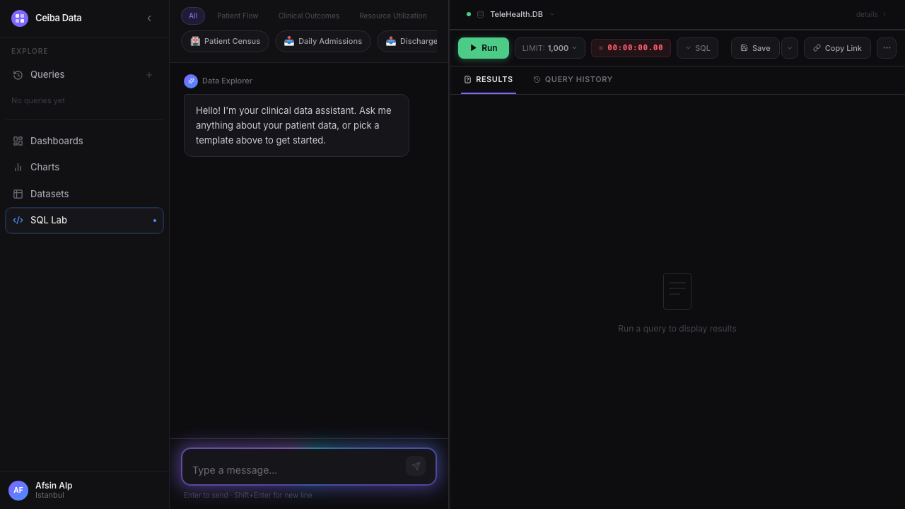
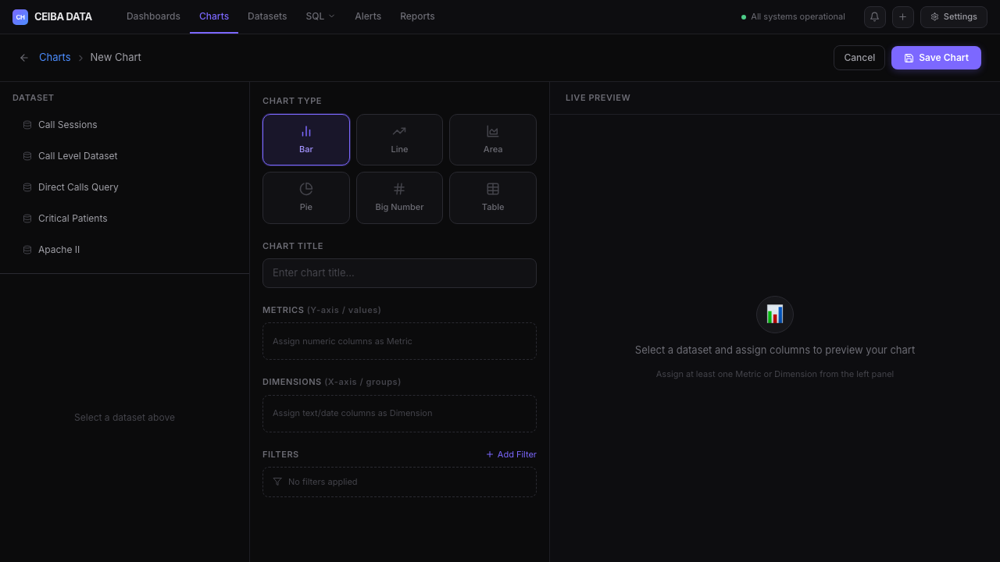
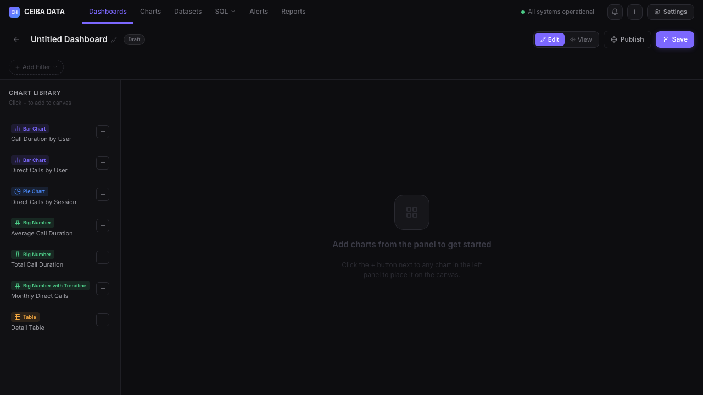
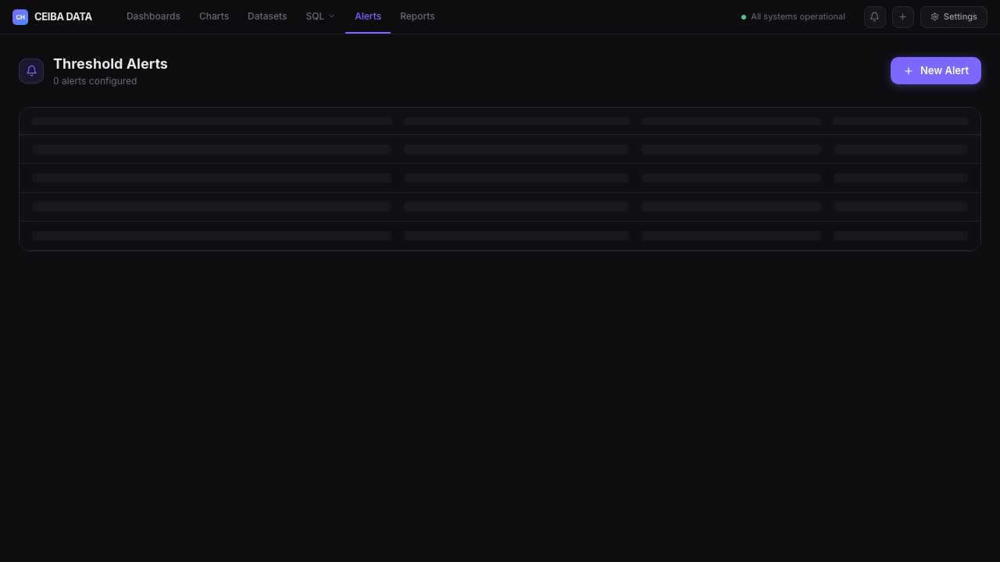
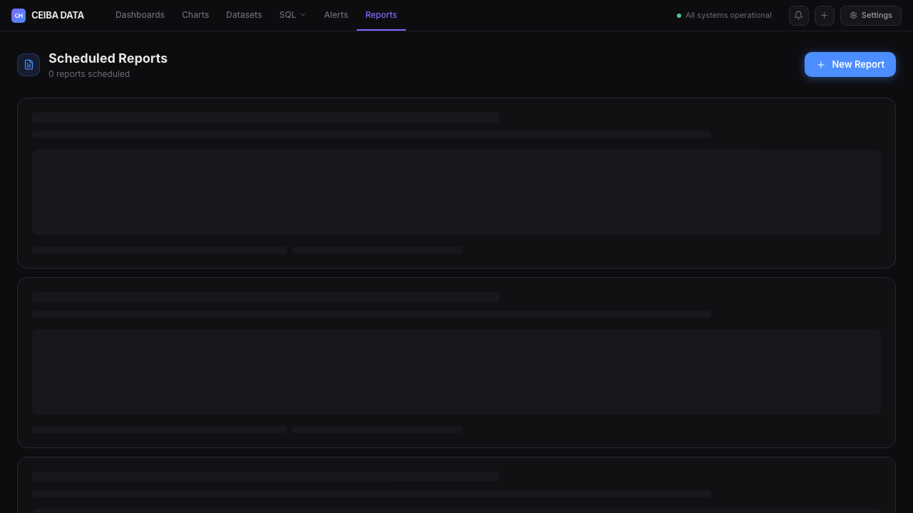
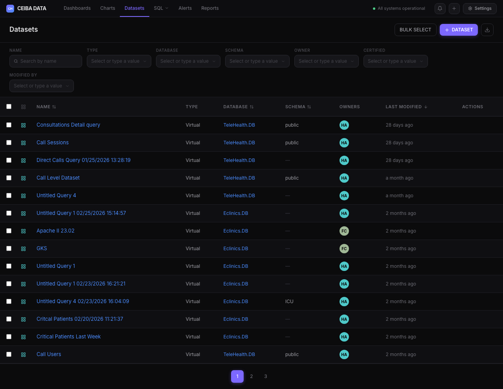

# Ceiba Data AI Explorer — User Manual

> Version 2.0 | Ceiba Healthcare

---

## Table of Contents

1. [Overview](#1-overview)
2. [Data Explorer — AI Chat](#2-data-explorer--ai-chat)
3. [Voice Input](#3-voice-input)
4. [Chart Builder](#4-chart-builder)
5. [Dashboard Canvas](#5-dashboard-canvas)
6. [Alerts & Threshold Monitoring](#6-alerts--threshold-monitoring)
7. [Scheduled Reports](#7-scheduled-reports)
8. [Comments & @Mentions](#8-comments--mentions)
9. [Exporting Data](#9-exporting-data)
10. [Datasets](#10-datasets)
11. [Mobile / Ward Rounds Mode](#11-mobile--ward-rounds-mode)
12. [Keyboard Shortcuts](#12-keyboard-shortcuts)

---

## 1. Overview

Ceiba Data AI Explorer is a clinical data intelligence platform built for Ceiba Healthcare. It lets clinical and operational teams query, visualize, and share healthcare data using plain English — no SQL knowledge required.

**Who is it for?**
- Physicians and clinicians who need patient data fast during rounds
- Operational managers tracking department performance
- Data analysts building dashboards and reports
- Executives monitoring KPIs

**Core principle:** Ask a question in plain English → get a SQL query, results, a chart, and an AI-generated narrative summary — all in one flow.

---

## 2. Data Explorer — AI Chat

The Data Explorer is the heart of the app. It combines an AI chat assistant with a live SQL editor and results panel.

### How to use it

1. **Type a question** in the chat input at the bottom of the left panel
   - Example: *"Show me all patients admitted to ICU this week"*
   - Example: *"Which department has the highest readmission rate?"*
2. The AI generates a SQL query and explains what it will do
3. Click **Set SQL** to load the query into the editor, then **Run** to execute
4. Results appear in the bottom-right panel as a table
5. An **AI Insight** narrative automatically appears above the results — a plain-English summary of key findings

### Template buttons
Quick-start buttons appear above the chat for common clinical queries:
- 🏥 Patient Census
- 📥 Daily Admissions
- 📤 Discharges Today
- 🔄 Readmissions
- ⏱️ Length of Stay
- 💊 Top Diagnoses
- 🛏️ ICU Occupancy
- and more…

Use the category filter pills (All / Patient Flow / Clinical Outcomes / Resource Utilization / Quality Metrics) to narrow them down. Use the **← →** arrows to scroll through all templates.

### SQL Editor
- Click **SQL** button in the toolbar to show/hide the generated query
- You can edit the SQL directly before running
- **LIMIT** dropdown controls how many rows to return (100 – 10,000)
- The timer shows how long the query took to execute
- **Save** stores the query for reuse
- **Copy Link** shares the query with a colleague

### AI Insight Panel
After every query run, the AI automatically generates:
- A 2–4 sentence clinical narrative summary
- **Green highlight chips** for key findings
- **Red anomaly chips** if unusual patterns are detected
- Click **↻ Regenerate** to get a fresh analysis
- Click **✕** to dismiss

---

## 3. Voice Input

Instead of typing, speak your question directly into the chat.

### How to use it

1. Click the **🎤 microphone button** to the left of the Send button
2. The button turns red and a waveform animation appears — **speak your question**
3. Your words appear in the text box in real-time as you speak
4. When you stop speaking, the transcript is confirmed and ready to send
5. Press **Enter** or click **Send** to submit

### Keyboard shortcut
`Cmd+Shift+M` (Mac) or `Ctrl+Shift+M` (Windows/Linux) toggles voice input on/off.

### Notes
- Requires microphone permission in your browser
- If permission is denied, a red banner will appear — check your browser settings
- Works best in Chrome or Edge (Web Speech API)
- Auto-stops after 10 seconds of silence

---

## 4. Chart Builder

Create visual charts from your data without writing any SQL.

### How to create a chart

1. Go to **Charts** in the top navigation
2. Click **+ Chart** (top right)
3. You'll see a 3-column builder:

**Step 1 — Pick a Dataset (left panel)**
- Select a dataset from the list
- Columns appear grouped by type: Text, Numeric, Date
- Click a column to assign it as a **Metric** (what to measure) or **Dimension** (how to group)

**Step 2 — Configure (center panel)**
- Choose a **Chart Type**: Bar, Line, Area, Pie, Big Number, or Table
- Your assigned Metrics appear in the "What to measure" section (Y-axis)
- Your assigned Dimensions appear in "Group by" (X-axis)
- Give the chart a **title**

**Step 3 — Preview (right panel)**
- A live chart renders as you configure it using real-looking mock data
- Colors follow Ceiba's brand palette

4. Click **Save Chart** — the chart is added to your library
5. You're redirected back to the Charts list

---

## 5. Dashboard Canvas

Combine multiple charts into a single dashboard view.

### How to create a dashboard

1. Go to **Dashboards** in the navigation
2. Click **+ Dashboard**
3. The builder has:
   - **Left sidebar** — your chart library (click **+** to show it on mobile)
   - **Main canvas** — a grid where charts live as widgets

### Adding charts
- Click **+ Add** next to any chart in the left sidebar
- It appears as a widget on the canvas

### Managing widgets
Each widget has controls:
- **S / M / L** buttons — resize the widget (small / medium / large)
- **↑ ↓ ← →** arrows — reposition it on the grid
- **💬** — open comments for that chart
- **✕** — remove it from the dashboard

### Filters
- Click **+ Add Filter** in the filter bar below the header
- Pick a column to filter on (Department, Hospital, Date Range, etc.)
- Active filters show as removable chips

### Saving & Publishing
- **Save** — saves the layout (stored locally)
- **Publish** — changes status from Draft → Published
- **Edit / View toggle** — View mode hides all editing chrome for a clean presentation

---

## 6. Alerts & Threshold Monitoring

Get notified automatically when a clinical metric crosses a threshold.

### Creating an alert

1. Go to **Alerts** in the navigation
2. Click **+ New Alert**
3. Fill in:
   - **Alert name** — e.g. "ICU High Occupancy"
   - **Metric** — choose from ICU Occupancy %, Readmission Rate, Average LOS, Ventilator Count, ED Wait Time, Mortality Flag Count, Daily Admissions
   - **Condition** — operator (>, <, >=, <=, ==) + threshold value
   - **Severity** — Low (blue) / Medium (amber) / Critical (red)
   - **Notify via** — Email, Telegram, In-App (or any combination)
   - **Cooldown** — how often to re-alert (1h / 4h / 24h)
4. Click **Save Alert**

### Managing alerts
- The alerts list shows all configured alerts with their conditions and status
- Toggle any alert **Active / Paused** with the switch
- Delete alerts with the trash icon

### In-app notifications
Click the **🔔 bell icon** in the top navigation to see all recent notifications. Notifications include:
- 🔴 Critical threshold breaches
- 🟡 Warning-level alerts
- ✅ Report delivery confirmations
- 💬 Comment @mentions

---

## 7. Scheduled Reports

Automatically deliver dashboard summaries on a schedule — perfect for morning rounds briefings.

### Creating a scheduled report

1. Go to **Reports** in the navigation
2. Click **+ New Report**
3. Configure:
   - **Report name**
   - **Dashboards** — select one or more dashboards to include
   - **Schedule** — Daily / Weekly / Monthly + time (e.g. 07:00)
   - **Delivery** — Email address and/or Telegram
   - **Format** — PDF, PNG, or Excel
4. Click **Save Report**
5. The confirmation screen shows the computed **next delivery time**

### Managing reports
- The reports list shows format badges, schedules, and next delivery countdown
- Edit or delete any report from the list

---

## 8. Comments & @Mentions

Collaborate with your team directly on dashboards and charts without leaving the app.

### Leaving a comment

**On a dashboard:**
- Click the **💬 Dashboard Comments** button in the top action bar
- A slide-over panel opens on the right
- Type your comment and press **Cmd+Enter** (Mac) or **Ctrl+Enter** (Windows) to submit

**On a chart widget (inside a dashboard):**
- Click the **💬** icon in the widget's header toolbar
- A comment thread slides open below the widget

**On the Charts list:**
- Each chart row has a comment icon showing the comment count
- Click it to open a comment modal

### @Mentioning a teammate
- Type **@** in the comment box
- A dropdown appears with team members: @afsin, @ege, @hazar, @clinical
- Click a name to insert the mention
- That person receives a notification in their bell icon

### Resolving comments
- Click the **✓** checkmark on any comment to mark it resolved
- Resolved comments show with strikethrough text (still visible for reference)

---

## 9. Exporting Data

Export query results directly from the results panel.

### CSV Export
1. Run a query and wait for results to appear
2. Click the green **CSV** button next to the Results tab
3. A `ceiba-results.csv` file downloads immediately
4. Best for: feeding into other tools, pipelines, or spreadsheet analysis

### Excel Export
1. Run a query and wait for results
2. Click the blue **Excel** button next to the Results tab
3. A `ceiba-results.xlsx` file downloads with a formatted sheet
4. Best for: sharing with colleagues, presentations, further analysis in Excel

> The export buttons only appear when there are results — they stay hidden on empty or error states.

---

## 10. Datasets

The Datasets page is a registry of all available data sources.

### What you'll find here
- **Virtual datasets** — saved queries that can be used as chart data sources
- **Database** and **Schema** each dataset belongs to (TeleHealth.DB or Eclinics.DB)
- **Owners** — who created and manages each dataset
- **Last modified** date

### Filtering
Use the filter bar at the top to search by:
- Name
- Type (Physical / Virtual)
- Database
- Schema
- Owner

### Actions (hover a row)
- ✏️ **Edit** — modify the dataset definition
- 🔗 **Share** — share with a team member
- 🗑️ **Delete** — remove the dataset

---

## 11. Mobile / Ward Rounds Mode

The app is fully optimized for use on mobile devices during ward rounds.

### Navigation
On mobile, the top navigation collapses and a **bottom tab bar** appears with:
- 🏠 Home
- 💬 Explorer
- 📊 Charts
- 🖥️ Dashboards
- 📁 Datasets

### Data Explorer on mobile
The 3-pane desktop layout becomes a **tab switcher**:
- **Chat** tab — full-screen AI conversation
- **SQL** tab — full-screen query editor
- **Results** tab — full-screen results table

### Ward Rounds banner
A "📋 Ward Rounds Mode" banner appears at the top of the Data Explorer on mobile. Tap **✕** to dismiss it for the session.

### Chart Builder on mobile
Converts to a **3-step wizard**:
1. Pick dataset & columns
2. Configure chart type
3. Preview & save

### Tips for ward rounds
- Use **Voice Input** to ask questions hands-free
- Use **Template buttons** for the fastest common queries
- Pin your most-used dashboards for instant access
- **Scheduled Reports** can deliver a morning briefing before rounds start

---

## 12. Keyboard Shortcuts

| Shortcut | Action |
|----------|--------|
| `Enter` | Send chat message |
| `Shift+Enter` | New line in chat |
| `Cmd+Shift+M` / `Ctrl+Shift+M` | Toggle voice input |
| `Cmd+Enter` / `Ctrl+Enter` | Submit comment |

---

## Getting Help

Click the **?** icon in the top-right navigation bar to open this Help Center at any time from within the app.

For technical support, contact your system administrator or the Ceiba Healthcare data team.

---

*Ceiba Data AI Explorer v2.0 — Built by Ceiba Healthcare*
